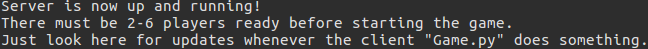
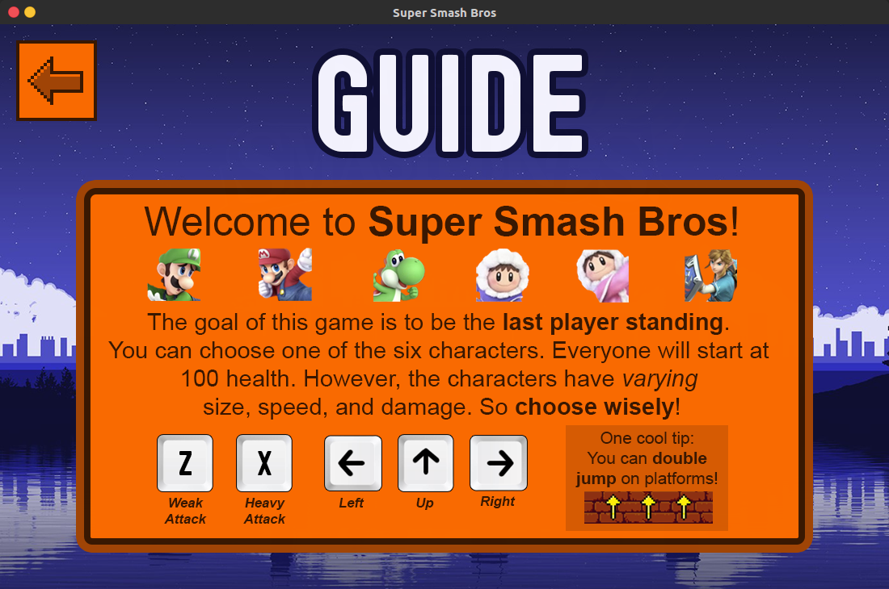
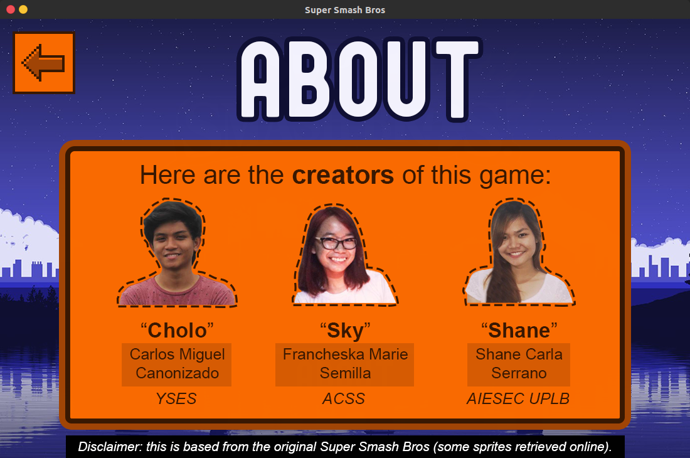
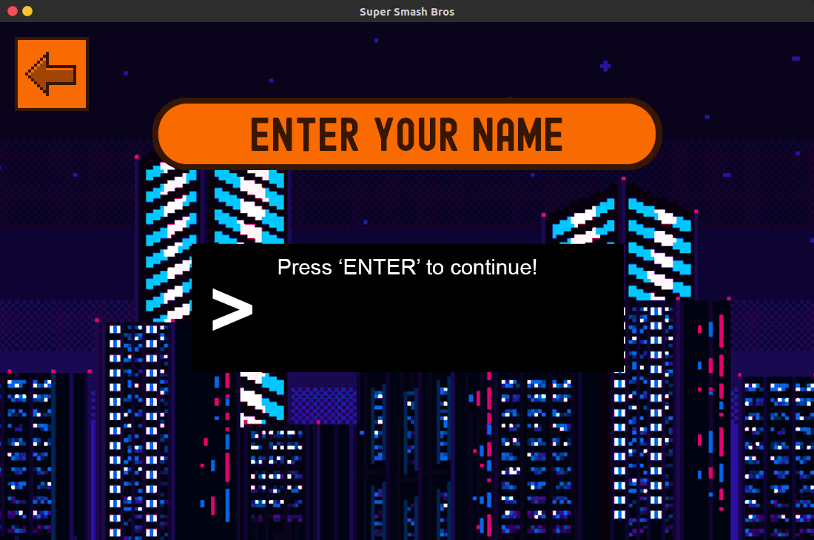
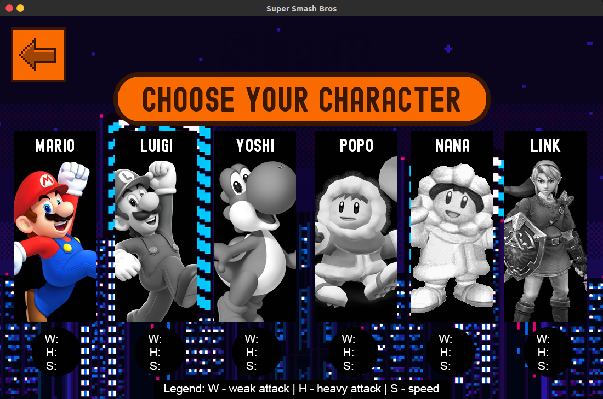
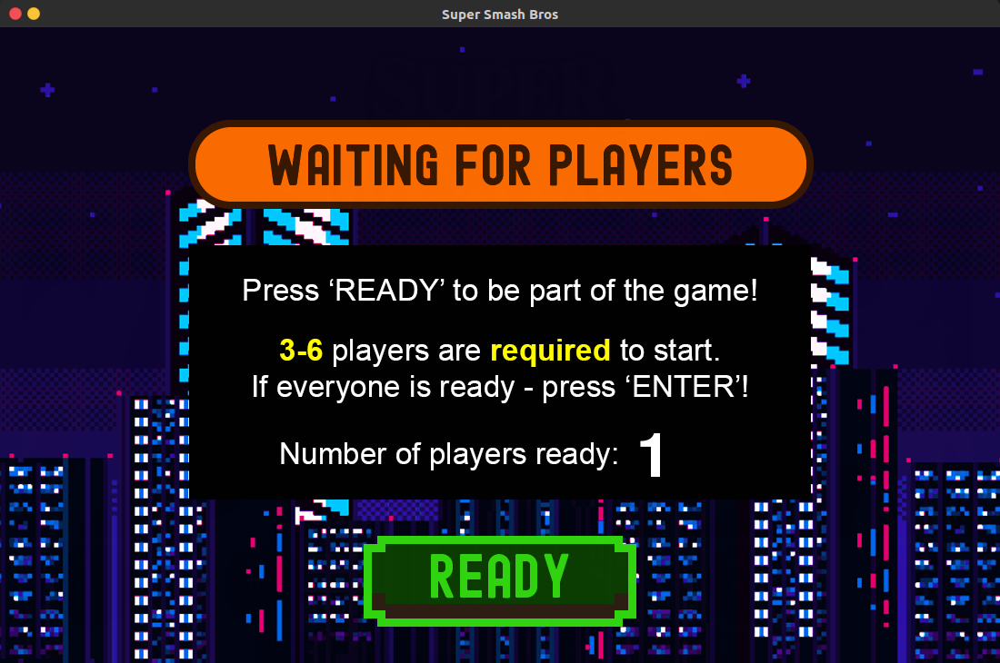
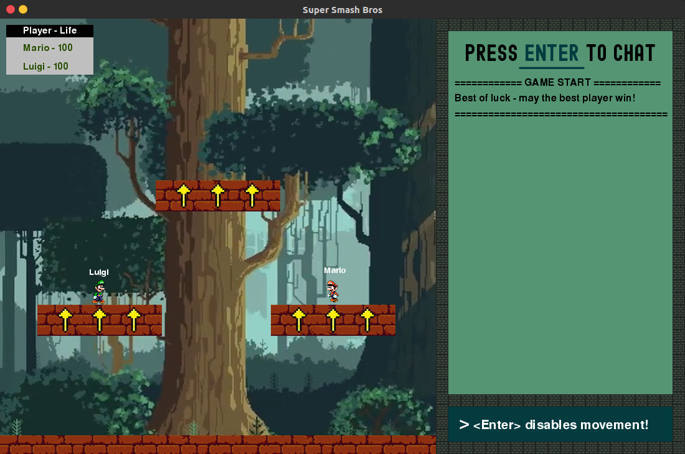

# Super Smash Bros

CMSC 137 project made in Python and developed by:
* Carlos Miguel Canonizado
* Francheska Marie Pelaez Semilla
* Shane Carla Serrano

## Play!

To play, clone or download this repository and then go to the **/src/game** directory. Once there, follow this:

```
# Remember to use python3!

# First, run the server:
python/python3 Server.py

# Then find the server's ip address and run the client:
python/python3 Game.py <ip_address>

# Have fun playing!
```

Some dependencies you might need:
* Protobuf - *optional - for in-game chat*
* Pygame - **required**

If you run it without errors, this should be the output:

### Server (terminal)


*Note - you only need one server at a time!*

### Client (game)


## More Screenshots

### Tutorial for your reference :)


### CMSC 137 CD-1L the best!


### Name input (checks if unique)


### Character selection (stats vary)


### Ready screen pre-game


### Sample arena with chat screen


## References

* [Socket Programming](https://realpython.com/python-sockets/)
* [Pygame](https://www.youtube.com/watch?v=i6xMBig-pP4&list=PLzMcBGfZo4-lp3jAExUCewBfMx3UZFkh5)
* [Sprites](https://www.spriters-resource.com/custom_edited/supersmashbroscustoms/?fbclid=IwAR0G88z4oHA2ZWQc-oSYQOJ7FSOXIfTfQX3JPYjGChVrdTTlS7wT8VZZrjA)