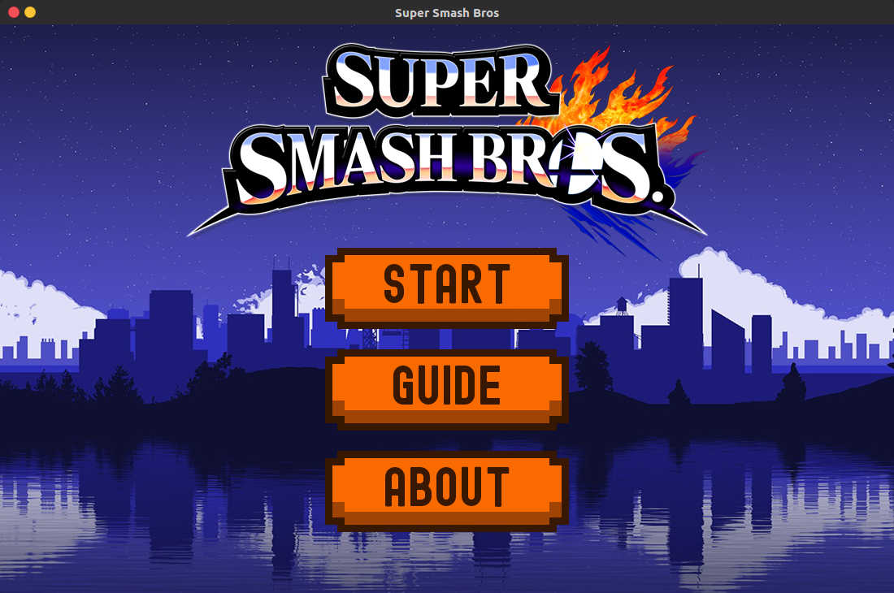

# Super Smash Bros

CMSC 137 project made in Python and developed by:
* Carlos Miguel Canonizado
* Francheska Marie Pelaez Semilla
* Shane Serrano

## Try our Game!

Our game is *currently in development* but in order to run, clone or download this repository then **go to the /src/game/** directory. Once there, you may execute the program:

```
# if python 3 is not your default
python3 Game.py
# else
python Game.py
```

Some dependencies you must have:
* Pygame
* Protobuf

If you run it without errors, the game should pop up:



## Before Development

1. Setup your SSH key by following this [tutorial](https://help.github.com/articles/adding-a-new-ssh-key-to-your-github-account/).

2. Clone the project with your SSH key by executing:
```
git clone git@github.com:CMCanonizado/137-project.git
```

3. Install [Sublime](https://www.sublimetext.com/3) or [Visual Studio Code](https://code.visualstudio.com/download) for ease of coding.

## Development Process

Make sure that you **NEVER** touch the master branch. For every additional feature, create a branch first. This command will create a new branch and automatically move to it:
```
git checkout -b <branch-name>
```

For naming the branch, just be descriptive about the feature you are developing (example: *highscores*). If you are done with the branch and you want it to reflect to the master branch, just create a *PR* (Pull Request) [here](https://github.com/CMCanonizado/137-project). Choose your branch and click *New pull request*.

### Useful Git Commands

Refer to this for saving progress in your branch. For the commit message, use present tense and state what you did (example: *Finish highscores*). When executing **git push origin HEAD** make sure that you are in your branch and **NOT** in the master branch.
```
git add .
git commit -m "Message"
git push origin HEAD 
```

Deleting a branch:
```
git push origin :<branch-name>
```

Rebasing:
```
git add .
git commit -m "Message"
git fetch
git rebase origin/master

IF THERE ARE NO CONFLICTS:
git push origin HEAD
```

Rebasing is done **before** you create a pull request so that there will be no problems in merging. In case you encounter conflicts after rebasing, **DO NOT** push immediately! Instead, resolve conflicts by doing this:

```
AFTER RESOLVING CONFLICTS (in code editor):
git add .
git rebase --continue

Repeat until there are no more conflicts!
```

*That's about it, happy coding!*

## References

* [Socket Programming](https://realpython.com/python-sockets/)
* [Pygame](https://www.youtube.com/watch?v=i6xMBig-pP4&list=PLzMcBGfZo4-lp3jAExUCewBfMx3UZFkh5)
* [Sprites](https://www.spriters-resource.com/custom_edited/supersmashbroscustoms/?fbclid=IwAR0G88z4oHA2ZWQc-oSYQOJ7FSOXIfTfQX3JPYjGChVrdTTlS7wT8VZZrjA) 

